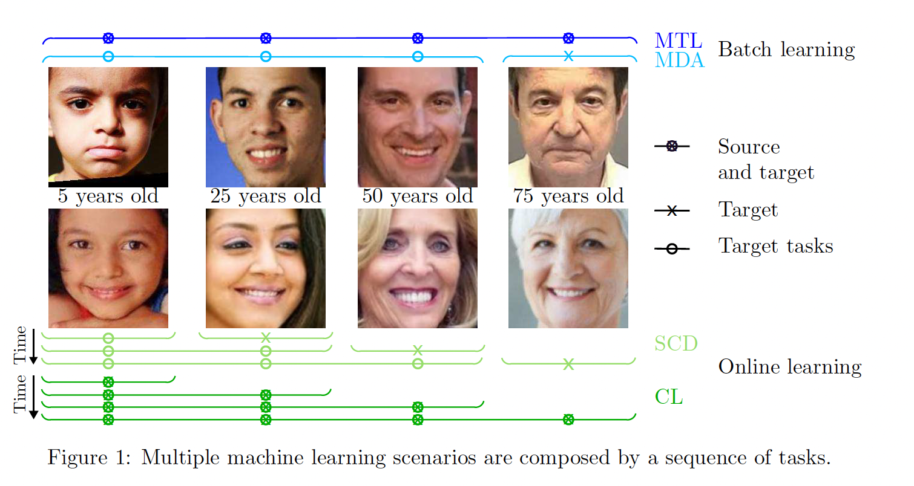

# Supervised-learning-evolving-tasks

  

This repository is the official implementation of the paper Supervised Learning with Evolving Tasks and Performance Guarantees.

The proposed learning methodology is applicable to multiple machine learning scenarios and adapts to evolving tasks.

## Source code

* main.m is the main file. In such file we can modify the values of the hyper-parameters, the scenario, and the feature mapping.
* fit.m fits the model.
* initialize.m initializes model variables.
* single_task.m obtains mean vector estimates, confidence vectors, and classifier parameters with single-task learning.
* forward.m obtains mean vector estimates, confidence vectors, and classifier parameters with forward learning.
* backward.m obtains mean vector estimates, confidence vectors, and classifier parameters with forward and backward learning.
* feature_vector.m calculates feature vectors using linear or random Fourier features (RFF) feature mappings.
* optimization.m updates classifier parameters.
* prediction.m assigns label to instances.

## Installation and evaluation

To train and evaluate the model in the paper, run main.m

## Support and Author

Verónica Álvarez

valvarez@bcamath.org

## License 

The for proposed methodology carries a MIT license.

## Citation

If you find useful the code in your research, please include explicit mention of our work in your publication with the following corresponding entry in your bibliography:

<a id="1">[1]</a> 
V. Alvarez, S. Mazuelas, J.A. Lozano.
"Supervised learning with evolving tasks and performance guarantees."

The corresponding BiBTeX citation is given below:
